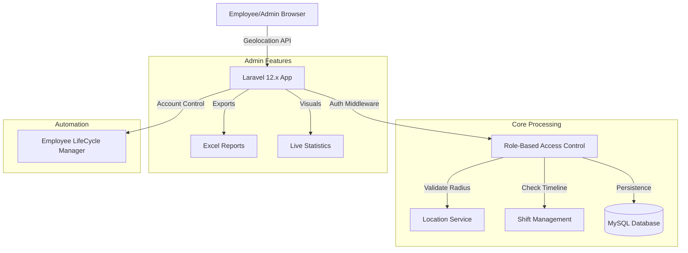

# 🏢 Employee Attendance Management System

[](https://laravel.com)
[](https://www.php.net/)
[](https://www.mysql.com/)
[](https://tailwindcss.com/)

A high-performance, enterprise-ready attendance solution designed for modern workplaces. This system handles the entire lifecycle of workplace tracking—from geolocation-validated check-ins and dynamic shift management to real-time status control and professional payroll reporting.

---

## 🏗️ System Architecture

Our system is designed for precision and security, integrating real-time location tracking with backend validation:



---

## ✨ Key Features

### 👔 Admin Intelligence Dashboard
*   **Live Metrics Tracking**: Instant visibility into **Total Employees**, **Present Today**, **Late Arrivals**, and **Absent** trends.
*   **Geolocation Precision**: Configure office locations with precise latitude/longitude and customizable **Authorized Radius** for clock-ins.
*   **Dynamic Settings**: Manage shift times (`In/Out Time`) and flexibility buffers (`Early Arrival`/`Late Grace`) per location.

### 🛡️ Precise Tracking & Security
*   **Radius-Based Check-ins**: Employees can only clock in if they are physically within the authorized radius of their assigned office.
*   **Automated Lifecycle Manager**: Instantly toggle employee status between **Active** and **Inactive**, with automated login blocking for departed staff.
*   **Stateless Security**: Robust role-based protection ensuring clear boundaries between Admin control and Employee self-service.

### 📊 Professional Insights & Reporting
*   **Real-time IST Display**: Digital clock synchronized with India Standard Time for accurate, fraud-proof logging.
*   **Reason Collection**: Mandatory reason capture for entries made outside of the flexible grace periods.
*   **Data Portability**: One-click **Excel Exports** for attendance records, optimized for HR and payroll workflows.

---

## 🛠️ Application Ecosystem

| Component | Responsibility | Primary Tech |
| :--- | :--- | :--- |
| **Auth System** | Multi-Role Security (Admin/Employee) | Laravel Breeze |
| **Geo-Service** | Radius validation and location capture | HTML5 Geolocation API |
| **Logic Layer** | Shift timelines, buffer checks, and status control | Laravel 12.x |
| **Time Engine** | IST Timezone-aware logging and reporting | Carbon + PHP 8.2 |
| **Storage Hub** | Employee profiles, locations, and attendance logs | MySQL 8.0 |
| **Frontend** | Modern, responsive, and high-DPI interface | Tailwind + Alpine.js |

---

## 🚀 Getting Started

### 1. Prerequisites
Ensure you have the following installed on your local machine:
*   **PHP 8.2+** & **Composer**
*   **Node.js 18+** & **npm**
*   **MySQL Database**

### 2. Clone the Repository
Clone the project to your local machine and navigate to the project folder:
```bash
git clone https://github.com/vipultikhe234/Employee-Attendance-Management-System.git
cd Employee-Attendance-Management-System
```

### 3. Install Dependencies
Install all required PHP and JavaScript packages:
```bash
composer install
npm install
```

### 4. Environment Configuration
Create a `.env` file from the example and configure your database:
```bash
cp .env.example .env
```
Update your database credentials in `.env`:
```env
DB_CONNECTION=mysql
DB_DATABASE=employee_attendance
DB_USERNAME=root
DB_PASSWORD=your_password
```

### 5. Database Setup & Seeding
Run migrations and populate the database with demo accounts:
```bash
php artisan migrate:fresh --seed
```

### 6. Build & Serve
Build the frontend assets and launch the local development server:
```bash
npm run build
php artisan serve
```

---

## 🔒 Security Configuration
The project is optimized for production-grade security and localized performance:
*   **Geolocation Privacy**: Requires **HTTPS** in production for browser location access.
*   **Timezone Isolation**: Set to `Asia/Kolkata` across the entire stack for unified logging.
*   **Worker Optimization**: Configured with `PHP_CLI_SERVER_WORKERS=4` for high local performance on Windows servers.

---

## 📂 Project Structure
```text
.
├── app/Http/Controllers/  # core Management Logic
├── app/Http/Middleware/   # Role & Status Verification
├── database/migrations/   # Schema for Employees, Locations, & Attendance
├── resources/views/       # Premium Blade + Tailwind Templates
├── routes/                # Unified Web & Auth Definitions
└── public/                # Asset storage and entry point
```

---

## 🛡️ License
Distributed under the MIT License. See `LICENSE` for more information.

---

Developed with ❤️ by **[Vipul Tikhe](https://github.com/vipultikhe234)**